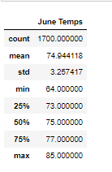
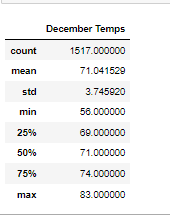
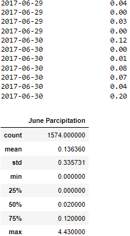

# Intro 
While on vacation in Hawaii we come up with an idea to open a buisnes. A busisness called Surf N Shake shop. We present our idea to an inverstor who also happens to be a famous surfer. W.Avy has some concers about the weather and ask if we can come up data to show how the weather has been in the last year. Also he would like us to provide additional information on months of June and December as we will have to present this data to rest of the investors. In this module we will be working with SQlite, SqlAlchemy and Flask. 

# Results
In the first deliverable we are collected temperature data for the month of June

In deliverable 2 we collected tempertature data for the month of December

1. If we look at max temps for June they are at 85 degrees and when comparing them to max temp of 83 degrees for the month Decmeber we can tell that they very close. 

2. The average temps for June were 75 and for the month of December they were at 71 degrees.

3. In the minimum temps is where we have seen some difference bewteen the two different months.  June was 64 degrees and the min temp for December was 56. 

# Summary
As we look at the data between the two months is very clear that our bussniess can survive year round. When we compared the data most of the days in each month's average temps are staying around 75 degrees. We also included the parcipitation charts to make sure the buissnes investors have a full picture of what an average year might look like. 

The average rain fall for the month of June is 0.13 while the average for December is 0.21. This information helps support rest of our data that will be presented to the investors.   

